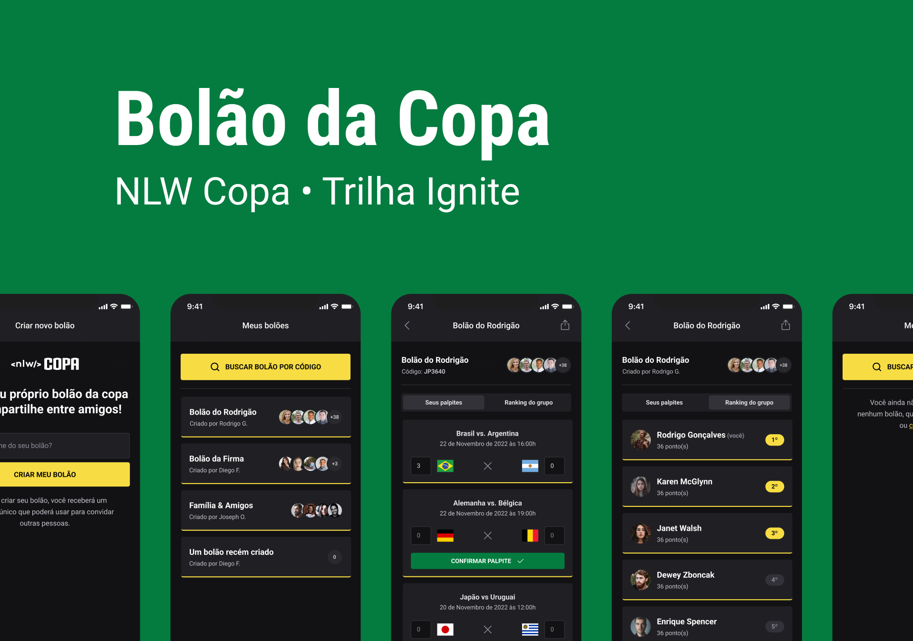

# NLW Copa • Trilha Ignite

Evento promovido pela [Rocketseat](https://www.rocketseat.com.br/), ministrado por [Diego Fernandes](https://github.com/diego3g) e [Rodrigo Gonçalves](https://github.com/rodrigorgtic).</p>

<p align="center">
  <a href="#rocket-tecnologias">Tecnologias</a>&nbsp;&nbsp;&nbsp;|&nbsp;&nbsp;&nbsp;
  <a href="#iphone-projeto">Projeto</a>&nbsp;&nbsp;&nbsp;|&nbsp;&nbsp;&nbsp;
  <a href="#gear-executar">Executar</a>&nbsp;&nbsp;&nbsp;|&nbsp;&nbsp;&nbsp;
  <a href="#nail_care-layout">Layout</a>&nbsp;&nbsp;&nbsp;|&nbsp;&nbsp;&nbsp;
  <a href="#memo-licença">Licença</a>
</p>



</br>

## :rocket: Tecnologias

Esse projeto foi desenvolvido com as seguintes tecnologias:

- [NodeJS](https://nodejs.org/en/)
- [Typescript](https://www.typescriptlang.org/)

---

- Server
  - [x] [Fastify](https://www.fastify.io/)
  - [x] [Prisma](https://www.prisma.io/)

- Web
  - [x] [ReactJS](https://reactjs.org/)
  - [x] [Next.JS](https://nextjs.org/)
- Mobile
  - [x] [React Native](https://reactnative.dev/)
  - [x] [Expo](https://expo.dev/)
  - [x] [Native Base](https://nativebase.io/)

## :iphone: Projeto

Bolão da copa

## :gear: Executar

Clonar o projeto para um diretório local:</p>

```bash
git clone https://github.com/EdlanioJ/nlw-copa.git
```

### Server

```bash
cd server
```

Criar un ficheiro `.env` com o template [.env.example](/server/.env.example) encontrado na pasta server.

```bash
yarn install

yarn run prisma migrate dev

yarn run prisma db seed

yarn run dev
```

Com [Docker](https://www.docker.com/)

```bash
docker compose up
```

### Web

```bash
cd web

yarn install
```

Criar un ficheiro `.env` com o template [.env.example](/web/.env.example) encontrado na pasta web.

```bash
yarn run dev
```

### Mobile

```bash
cd web

yarn install
```

env` com o template [.env.example](/mobile/.env.example) encontrado na pasta mobile.

Crie um novo projeto na [Google Cloud](https://console.cloud.google.com), configure o sistema de autenticação e copie as credencias para o ficheiro `.env`.

```bash
npx expo start
```

## :nail_care: Layout

Você pode visualizar o layout do projeto através do desse [link :link:](https://www.figma.com/file/cY3K7PeTpIS9qaoFIPvFJv/Bol%C3%A3o-da-Copa-(Community)?node-id=316%3A2316). É necessário ter conta no [Figma](https://figma.com) para acessá-lo.

## :memo: Licença

Esse projeto está sob a licença MIT.

---

Feito com :heart: by [Edlâneo Manuel](https://github.com/EdlanioJ) :wave:
